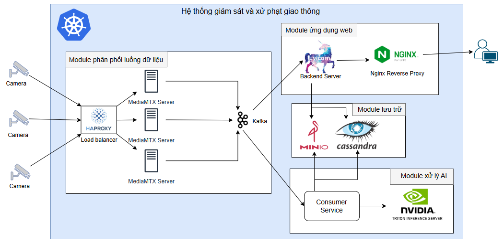

## System Architecture


## Setup steps
Clone projects
```bash
git clone https://github.com/Lam03tn/Traffic_Monitoring_System.git
```
### Option 1: Running with Docker

Can run docker with either created images or create images for Backend FastAPI, Frontend React, Producer, Consumer
```bash
docker-compose up -d
```

Create init for cassandra and minio with camera_list.py and init_cassandra.py

After that, you can access
```bash
localhost:80
```
to interact with system through UI or
```
localhost:28000/redoc
```
for backend API docs

To build image, use Dockerfile to create. For example
```bash
docker-compose -f .\docker-compose-producer.yaml build 
```

### Option 2: Running with Kubernetes
The folder 'k8s' has divide into services, deployments, configmaps, and secrets. 
```bash
kubectl apply -f
```
to apply serrvices, deployments, configmaps, and secrets

Run Jobs to init database. Create VPN to tranmiss RTSP into cluster and Cloudflare to expose web through port 31000
